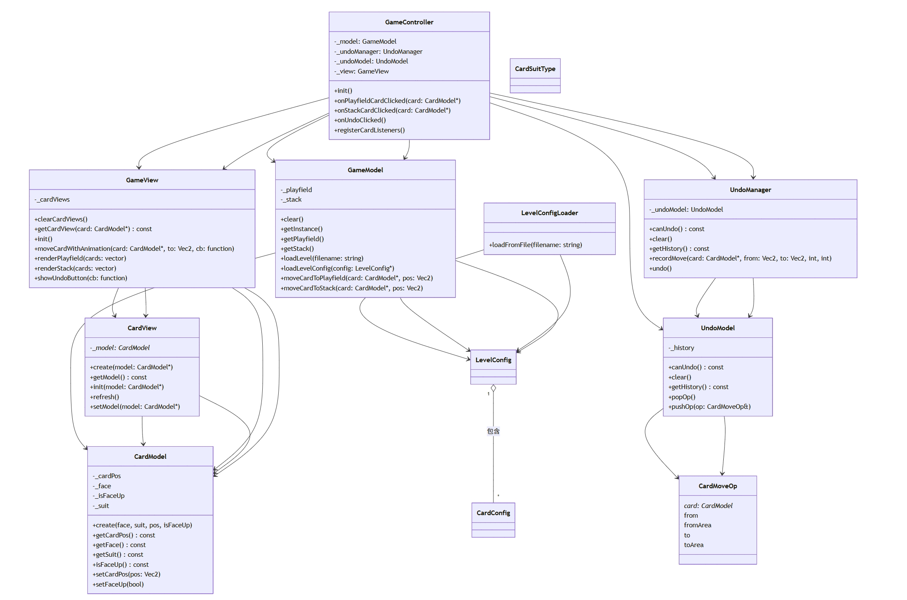
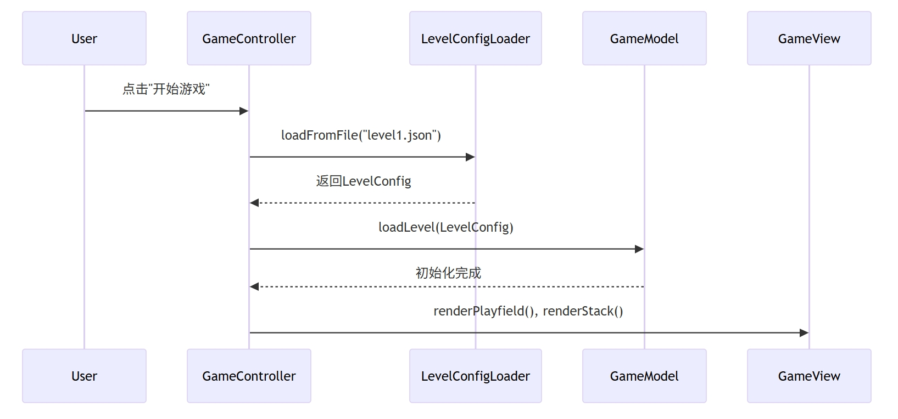
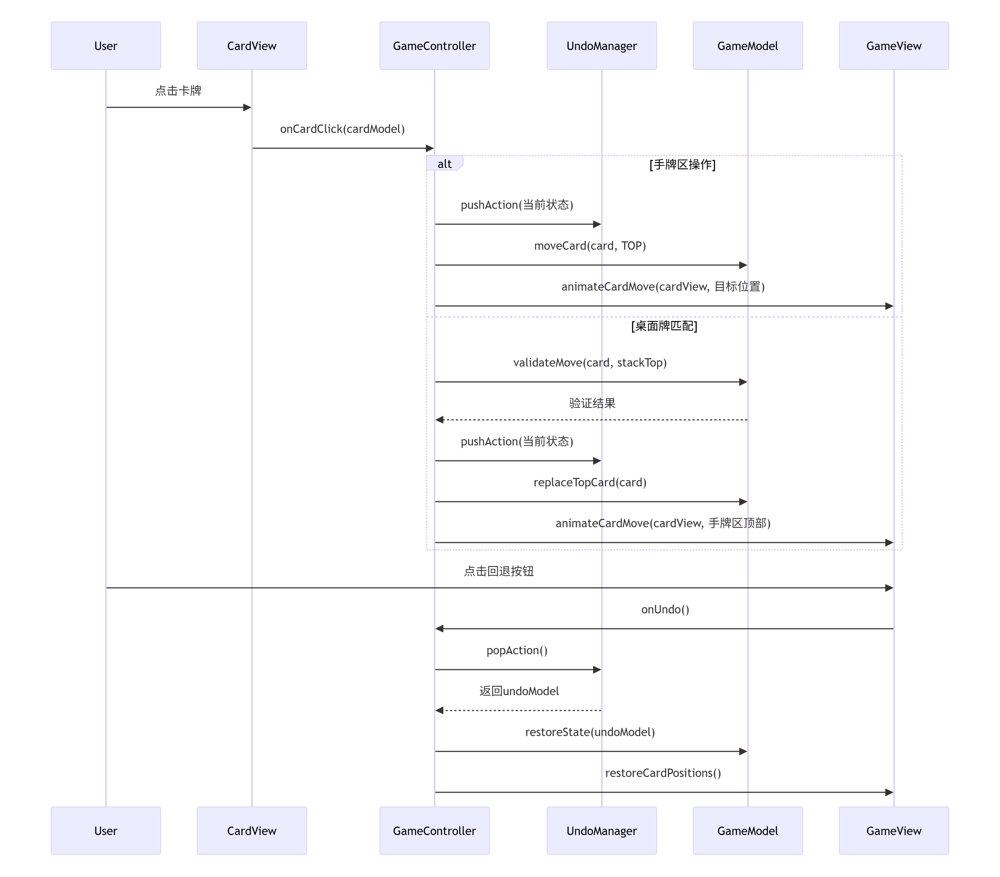
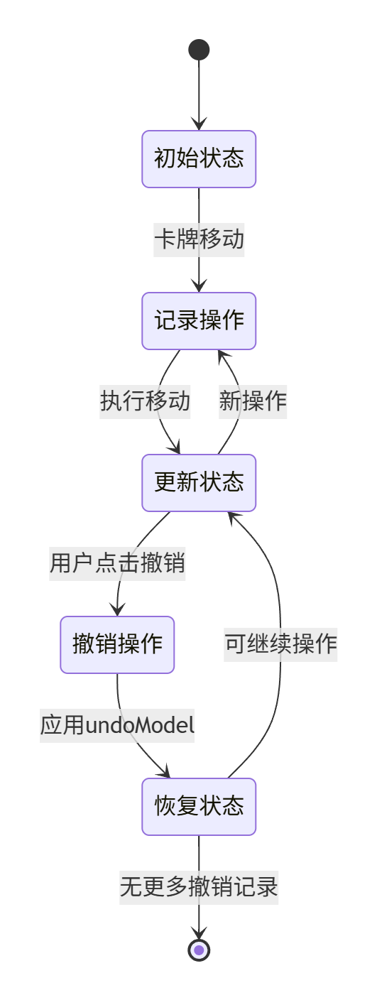

# 卡牌游戏Demo程序设计文档

## 1.项目概述
本项目是一款基于cocos2d-x引擎的卡牌游戏Demo，采用MVC（Model-View-Controller）架构分层设计，  
初步实现了基于JSON文件的关卡模拟配置，着重实现了手牌（备用牌）和桌牌的移动以及操作回退等核心玩法，留意了代码留白和分层解耦，具有良好的可扩展性和可维护性。

## 2.项目功能需求说明
1.	通过JSON文件实现简单的模拟关卡配置，初始化本局游戏的卡牌花色、点数以及位置
2.	支持卡牌的点击移动、动画平移，实现手牌区（备用牌）到顶部牌位置的替换
3.	支持桌面牌和手牌区顶部牌的互动，实现点数差为一的桌面牌到手牌区的移动，替换手牌区顶部牌成为新的顶部牌
4.	支持卡牌移动操作的记录，维护卡牌移动操作栈，实现卡牌操作的逆序回退操作，直到无法进行撤销操作

## 3.系统架构设计

### 3.1 架构模式
•	采用经典 MVC（Model-View-Controller）模式，将数据、视图和业务逻辑解耦。  
•	配置部分采用“数据模型+加载器”分离设计，便于扩展和管理。

### 3.2 系统结构图
```
Classes/
├─ configs/
│   ├─ loaders/         #配置加载器
│   │   └─ LevelConfigLoader.cpp/.h
│   └─ models/          #配置数据模型  
│       └─ LevelConfig.h
├─ controllers/         #控制器
│   └─ GameController.cpp/.h
├─ managers/            #管理器
│   └─ UndoManager.cpp/.h
├─ models/              #运行时数据模型
│   ├─ CardModel.cpp/.h
│   ├─ GameModel.cpp/.h
│   └─ UndoModel.cpp/.h
├─ views/               #视图层
│   ├─ CardView.cpp/.h
│   └─ GameView.cpp/.h
├─ services/            #服务层
├─ utils/               #工具类

```

### 3.3 模块关系与责任

#### 1. configs（配置层）
- **作用**：配置数据定义与加载，负责游戏关卡等静态数据的结构化和解析，支持灵活关卡扩展。
    - **loaders/LevelConfigLoader.cpp/.h**：实现关卡配置文件（如JSON）的读取和解析，将配置数据转换为游戏可用的结构体对象。
    - **models/LevelConfig.h**：定义关卡配置数据结构（如卡牌初始布局、花色、点数、位置等），为加载器和模型提供数据支持。

#### 2. controllers（控制器层）
- **作用**：游戏主流程与交互的调度中心，实现MVC架构中的“C”。
    - **GameController.cpp/.h**：负责用户操作的响应（如点击、移动、撤销等），协调Model和View的协作，管理游戏状态的转换。

#### 3. managers（管理器层）
- **作用**：对特殊功能进行集中管理，提升系统的可扩展性与可维护性。
    - **UndoManager.cpp/.h**：实现卡牌操作的记录、撤销与重做功能，维护操作历史栈，支持多步回退。

#### 4. models（数据模型层）
- **作用**：承载核心游戏数据和业务逻辑，是MVC架构中的“M”。
    - **GameModel.cpp/.h**：维护游戏全局状态（如牌堆、桌面、手牌区等），实现核心逻辑（如移动、匹配、胜负判断）。
    - **CardModel.cpp/.h**：定义单张卡牌的属性与状态（如花色、点数、正反面、位置），支撑游戏规则判断与界面表现。
    - **UndoModel.cpp/.h**：用于记录每一步操作的快照，便于撤销时恢复状态。

#### 5. views（视图层）
- **作用**：负责界面展现和用户交互反馈，是MVC架构中的“V”。
    - **GameView.cpp/.h**：整体游戏主界面的渲染、布局、动画和按钮管理，根据GameModel数据及时刷新UI。
    - **CardView.cpp/.h**：单张卡牌的具体界面表现，含动画、缩放、点击等视觉反馈。

#### 6. services（服务层/系统支持扩展）
- **作用**：预留为项目后续扩展提供服务支撑，如网络通信、存档加载等。当前为空目录，便于未来功能迭代时扩展。

#### 7. utils（工具层）
- **作用**：存放项目通用工具类与辅助功能（如坐标计算、动画辅助、日志记录等），为各层模块提供基础能力支撑。

## 3.4 核心模块关系
### UML图


## 3.5 关键流程图

### 3.5.1 游戏初始化流程


### 3.5.2 卡牌点击移动流程


### 3.5.3 操作回退状态流程图


## 4.详细代码设计与实现

### 4.1 主要类与模块详细设计

#### 4.1.1 CardModel
#### 主要成员属性

| 成员名      | 类型             | 说明                   |
|-------------|------------------|----------------------|
| _face       | int              | 点数，见CardFaceType枚举类型 |
| _suit       | int              | 花色，见CardSuitType枚举类型 |
| _isFaceUp   | bool             | 是否正面朝上               |
| _cardPos    | cocos2d::Vec2    | 牌的位置                 |

#### 主要成员方法

| 方法声明                                                                 | 说明                              |
|--------------------------------------------------------------------------|-----------------------------------|
| static CardModel* create(int face, int suit, const cocos2d::Vec2& pos, bool isFaceUp = true) | 创建一张牌                       |
| int getFace() const                                                      | 获取牌号                         |
| int getSuit() const                                                      | 获取花色                         |
| void setFaceUp(bool up)                                                  | 设置是否正面朝上                 |
| bool isFaceUp() const                                                    | 判断是否正面朝上                 |
| void setCardPos(const cocos2d::Vec2& pos)                                | 设置牌的位置                     |
| cocos2d::Vec2 getCardPos() const                                         | 获取牌的位置                     |
| bool init(int face, int suit, const cocos2d::Vec2& pos, bool isFaceUp)   | 初始化函数（内部使用）           |

#### 设计说明
- CardModel 负责封装单张扑克牌的所有基本属性与状态。
- 支持引用计数管理，便于 Cocos2d-x 场景下内存自动管理。
- 通过工厂方法 `create` 实例化，保证初始化合法。
- 通过 get/set 方法封装访问，保证属性安全与可维护性。

### 4.1.2 GameModel
#### 主要成员属性

| 成员名        | 类型                      | 说明                              |
|---------------|--------------------------|-----------------------------------|
| _playfield    | std::vector<CardModel*>  | 桌面区卡牌列表，表示当前位于桌面的牌 |
| _stack        | std::vector<CardModel*>  | 手牌区卡牌列表，表示当前位于手牌堆的牌 |

#### 主要成员方法

| 方法声明                                                                                   | 说明                                      |
|--------------------------------------------------------------------------------------------|-----------------------------------------|
| static GameModel* getInstance()                                                            | 获取 GameModel 单例指针                       |
| void loadLevelConfig(LevelConfig* config)                                                  | 使用关卡配置对象加载卡牌，重建桌面区和手牌区                  |
| void loadLevel(const std::string& jsonPath)                                                | 通过 json 路径加载关卡，内部调用 LevelConfigLoader   |
| std::vector<CardModel*>& getPlayfield()                                                    | 获取桌面区卡牌容器的引用                            |
| std::vector<CardModel*>& getStack()                                                        | 获取手牌区卡牌容器的引用                            |
| void moveCardToPlayfield(CardModel* card, const cocos2d::Vec2& toPos)                      | 将指定卡牌移到桌面区，并更新其位置                       |
| void moveCardToStack(CardModel* card, const cocos2d::Vec2& toPos)                          | 将指定卡牌移到手牌区，并更新其位置                       |
| void clear()                                                                               | 清空桌面区和手牌区，释放所有卡牌对象，用于初始化游戏关卡或关卡结束时的卡牌释放 |

#### 设计说明

- **单例模式**：GameModel 采用单例模式，保证全局唯一数据模型，通过 `getInstance()` 获取。
- **卡牌管理**：分别用 `_playfield` 和 `_stack` 两个容器存储桌面区和手牌区的卡牌对象指针。
- **关卡加载**：支持两种关卡加载方式：直接通过 `LevelConfig` 配置对象加载（推荐），或通过 json 路径间接加载（兼容旧接口）。
- **内存管理**：加载卡牌时会对每个 `CardModel` 进行 `retain`，在 `clear()` 时释放，避免内存泄漏。
- **卡牌移动**：`moveCardToPlayfield` 和 `moveCardToStack` 用于在两个区域间移动卡牌，并负责更新卡牌的位置属性。
- **适用场景**：该类集中管理整个游戏的卡牌状态，是游戏逻辑的核心数据结构，为控制器和视图层提供数据支持。

### 4.1.3 UndoModel
#### 主要成员属性

| 成员名      | 类型                        | 说明                                  |
|-------------|-----------------------------|---------------------------------------|
| _history    | std::stack<CardMoveOp>      | 撤销操作历史栈，按顺序存储牌的移动操作记录 |

#### 相关数据结构

| 结构体名      | 字段         | 类型                | 说明                   |
|---------------|--------------|---------------------|------------------------|
| CardMoveOp    | card         | CardModel*          | 被移动的牌指针         |
|               | from         | cocos2d::Vec2       | 起始位置               |
|               | to           | cocos2d::Vec2       | 目标位置               |
|               | fromArea     | int                 | 起始区域（0: 手牌, 1: 桌面）|
|               | toArea       | int                 | 目标区域               |

#### 主要成员方法

| 方法声明                                                        | 说明                                   |
|-----------------------------------------------------------------|----------------------------------------|
| void pushOp(const CardMoveOp& op)                               | 添加一条操作记录到历史栈               |
| CardMoveOp popOp()                                              | 弹出最近一条操作记录（执行撤销时调用） |
| bool canUndo() const                                            | 判断是否还有可撤销操作                 |
| void clear()                                                    | 清空所有操作历史记录                   |
| const std::stack<CardMoveOp>& getHistory() const                | 获取只读的历史栈（用于只读显示）       |

#### 设计说明

- **职责单一**：UndoModel 只负责撤销历史数据的存储与管理，不参与具体的撤销操作逻辑实现，符合单一职责原则。
- **数据结构**：采用 `std::stack<CardMoveOp>` 维护操作历史，先进后出，便于实现撤销功能。
- **CardMoveOp 结构体**：完整记录每次卡牌移动的卡牌对象、起止位置和区域，保证撤销操作所需的所有关键信息可追溯。
- **典型用法**：
  - 游戏操作发生时，调用 `pushOp` 存储操作信息。
  - 用户点击撤销时，调用 `popOp` 弹出最近操作，交由撤销逻辑处理。
  - `canUndo` 用于界面判断是否可撤销，`clear` 用于切换关卡或重置游戏时清空历史。

#### 典型调用流程示例

```
1. 卡牌移动时，构造 CardMoveOp，调用 pushOp 存入历史栈；
2. 用户点击撤销，先调用 canUndo 检查，然后调用 popOp 获取最近操作；
3. 游戏重置或新关卡加载时，调用 clear 清空历史；
4. UI 只读显示操作历史时，调用 getHistory 获取历史栈引用；
```

### 4.1.4 UndoManager
#### 主要成员属性

| 成员名        | 类型              | 说明                                          |
|---------------|------------------|-----------------------------------------------|
| _undoModel    | UndoModel*       | 持有的撤销数据模型指针，仅负责数据存取与交互  |

#### 主要成员方法

| 方法声明                                                                                      | 说明                                      |
|-----------------------------------------------------------------------------------------------|-------------------------------------------|
| UndoManager(UndoModel* undoModel)                                                             | 构造函数，注入 UndoModel 指针             |
| void recordMove(CardModel* card, cocos2d::Vec2 from, cocos2d::Vec2 to, int fromArea, int toArea) | 记录一次牌移动操作到撤销历史              |
| CardMoveOp undo()                                                                             | 执行撤销操作，返回撤销的操作数据          |
| bool canUndo() const                                                                          | 判断是否有可撤销操作                      |
| void clear()                                                                                  | 清空所有撤销历史                          |
| const std::stack<CardMoveOp>& getHistory() const                                              | 获取只读撤销历史（用于 UI 展示等）        |

#### 设计说明

- **控制解耦**：UndoManager 作为控制器逻辑层的成员变量，不是单例，通过依赖注入方式持有 UndoModel，实现撤销相关的业务逻辑。
- **职责分明**：UndoModel 只做历史数据存储，UndoManager 只做撤销逻辑，不直接操作游戏状态，由上层 Controller 调用实际回退操作。
- **撤销流程**：
  - 游戏每次牌移动时，调用 `recordMove` 记录操作。
  - 执行撤销时，先判断 `canUndo()`，再调用 `undo()` 弹出最近一次操作（由 Controller 负责恢复牌的状态和位置）。
  - `clear()` 用于场景重置、切换关卡等情况下清空历史记录。
  - `getHistory()` 可用于界面显示撤销历史。

#### 典型调用流程示例

```
1. 创建 UndoManager 时，传入 UndoModel 指针。
2. 牌移动时，调用 recordMove 记录操作（包括起止位置和区域）。
3. 用户点击撤销时，先 canUndo 检查，后 undo 弹出操作数据，由 Controller 恢复状态。
4. 游戏重置、关卡切换时，调用 clear 清空历史。
5. UI 需要展示撤销历史时，调用 getHistory 获取只读栈。
```

### 4.1.5 GameController
#### 主要成员属性

| 成员名         | 类型             | 说明                                    |
|----------------|------------------|-----------------------------------------|
| _view          | GameView*        | 游戏主界面视图，负责界面渲染与交互      |
| _model         | GameModel*       | 游戏数据模型，管理所有牌的状态          |
| _undoModel     | UndoModel*       | 撤销操作数据模型，记录历史操作          |
| _undoManager   | UndoManager*     | 撤销管理器，负责撤销逻辑处理            |

#### 主要成员方法

| 方法声明                                         | 说明                                             |
|--------------------------------------------------|--------------------------------------------------|
| virtual bool init()                              | 控制器初始化           |
| static GameController* create()                  | Cocos2d-x 标准工厂方法                           |
| void registerCardListeners()                     | 注册所有可交互牌的事件监听器                     |
| void onStackCardClicked(CardModel* card)         | 处理手牌区牌的点击事件                    |
| void onPlayfieldCardClicked(CardModel* card)     | 处理桌面区牌的点击事件                           |
| void onUndoClicked()                             | 处理回按钮点击事件                      |

#### 设计说明

- **MVC 协作核心**：GameController 作为控制器，负责连接数据模型（Model）、视图（View），以及处理用户交互。
- **撤销机制集成**：持有 UndoModel 和 UndoManager，记录与执行撤销操作，保证数据和界面同步回退。
- **事件注册与解耦**：
  - `registerCardListeners` 动态为所有可操作卡牌注册触摸监听，实现灵活的交互响应，避免重复注册。
- **操作流程**：
  - **牌点击**：分为手牌堆牌点击和桌面区牌点击，分别处理移动逻辑与动画，并记录操作到撤销历史。
  - **撤销操作**：点击回退按钮时，检查是否可撤销，弹出历史记录并恢复对应牌的位置与区域，实现动画与数据回滚同步。
- **界面与数据刷新**：每次操作后调用视图层的刷新方法，保证界面实时反映数据变化。

#### 典型调用流程示例

```
1. 控制器初始化时，创建/获取数据模型与视图，加载关卡数据，注册所有监听器。
2. 用户点击牌时（手牌或桌面区），控制器判断合法性，执行数据移动并记录操作历史，驱动界面动画与刷新。
3. 用户点击撤销按钮时，控制器通过 UndoManager 弹出历史操作，恢复数据与界面状态。
4. 每次操作后重新注册监听器，确保交互状态准确。
```

### 4.1.6 CardView
#### 主要成员属性

| 成员名     | 类型          | 说明                             |
|------------|---------------|----------------------------------|
| _model     | CardModel*    | 绑定的数据模型指针，源自 CardModel |

#### 主要成员方法

| 方法声明                                                          | 说明                                      |
|-------------------------------------------------------------------|-------------------------------------------|
| static CardView* create(CardModel* model)                         | 工厂方法，创建并初始化与模型绑定的牌视图   |
| void setModel(CardModel* model)                                   | 重新绑定数据模型，并刷新视图               |
| CardModel* getModel() const                                       | 获取当前绑定的数据模型                     |
| void refresh()                                                    | 刷新显示内容（点数、花色等）               |
| bool init(CardModel* model)                                       | 视图初始化，加载底图，绑定模型（保护方法） |

#### 设计说明

- **模型-视图绑定**：CardView 作为 Sprite 派生类，绑定一个 CardModel 指针，实现数据与表现层分离。
- **工厂创建**：通过 `create` 静态方法实例化，保证 Cocos2d-x 生命周期和内存管理。
- **属性刷新**：每当点数、花色、朝向等数据变化时，调用 `refresh()` 更新显示内容，包括小数字、花色图标、大数字等 Sprite 资源。
- **正面判定**：仅在模型表示为正面朝上时显示牌面内容，背面状态下不显示点数和花色。
- **资源加载**：自动拼接资源路径加载相应数字和花色图片，通过 Sprite 子节点叠加实现牌面视觉效果。
- **容错性**：对非法牌号和花色做日志输出，避免资源加载错误导致崩溃。

### 4.1.7 GameView
#### 主要成员属性

| 成员名      | 类型                                        | 说明                          |
|-------------|---------------------------------------------|-------------------------------|
| _cardViews  | std::unordered_map<CardModel*, CardView*>   | 数据模型与视图的映射表        |

#### 主要成员方法

| 方法声明                                                                                  | 说明                    |
|-------------------------------------------------------------------------------------------|-----------------------|
| virtual bool init()                                                                       | 初始化界面                 |
| static GameView* create()                                                                 | Cocos2d-x 标准工厂方法      |
| void renderPlayfield(const std::vector<CardModel*>& cards)                                | 渲染桌面区所有牌，横排自适应布局      |
| void renderStack(const std::vector<CardModel*>& cards)                                    | 渲染手牌区所有牌，横排自适应布局      |
| void showUndoButton(const std::function<void()>& callback)                                | 显示“RollBack”按钮并注册点击回调 |
| void moveCardWithAnimation(CardModel* model, const cocos2d::Vec2& to, std::function<void()> onComplete = nullptr) | 动画移动某张牌到目标位置，动画结束后可回调 |
| CardView* getCardView(CardModel* model) const                                             | 获取指定数据模型对应的视图         |
| void clearCardViews()                                                                     | 移除并清空所有卡牌视图           |

#### 设计说明

- **视图分区**：GameView 负责游戏主界面，包括桌面区（主牌区）和手牌区（堆区）的所有牌的布局与显示。
- **自动布局**：渲染函数根据当前牌数量和可用空间自动调整牌间距、缩放比例，实现自适应横排布局，保证视觉美观和空间利用。
- **数据-视图映射**：通过 `_cardViews` 哈希表，快速查找和维护 CardModel 与 CardView 的对应关系，便于界面刷新和动画操作。
- **动画支持**：`moveCardWithAnimation` 支持牌的平滑移动动画，操作完成后触发回调，保证数据与界面同步。
- **交互按钮**：`showUndoButton` 显示“回退”按钮并注册回调，实现撤销操作的入口。
- **资源回收**：`clearCardViews` 确保切换关卡或刷新时及时移除所有旧视图，防止内存泄漏和界面残影。

## 4.2 关键算法实现
### 4.2.1 卡牌点击与移动逻辑
#### 相关类

- **GameController**：负责事件监听注册、点击响应、业务决策、动画驱动和撤销历史记录。
- **GameModel**：数据层，实现牌区与手牌区的实际数据结构管理和移动操作。
- **GameView/CardView**：负责卡牌视图的获取、动画移动和界面刷新。
- **UndoManager**：记录每一次操作，支持撤销。

---

#### 主要价值

- 实现了用户牌点击后，数据、视图和操作历史的完整联动，是游戏交互性的核心。
- 保证了数据层和表现层的同步，所有移动操作都可撤销。
- 支持灵活的规则扩展（如点数相邻判定、牌区限制等）。

---

#### 算法描述

1. **监听注册**  
   - 每次界面刷新后，所有可交互的牌重新注册监听器，保证最新状态下的交互。
   - 手牌区除顶牌外可点击，桌面区所有牌可点击。

2. **点击处理**  
   - 用户在手牌区点击非顶牌：将该牌移到堆顶，并动画移动，记录操作历史。
   - 用户在桌面区点击牌：只有当被点击牌与手牌顶牌点数相差1时才可移动，将牌放到手牌区顶端，动画移动，记录操作历史。

3. **数据与动画联动**  
   - 牌的实际移动通过 erase/push_back 实现，动画同步到目标位置。
   - 移动后界面刷新，监听器重注册，保持状态一致。

4. **操作历史记录**  
   - 每一次合法移动都通过 UndoManager 记录操作详情（牌对象、起止位置、区域等），以支持撤销。

---

#### 关键代码片段

**1. 事件监听注册**  
```cpp
// 注册所有可交互牌的监听器
void GameController::registerCardListeners()
{
    // 获取事件分发器
    auto dispatcher = _view->getEventDispatcher();

    // 先移除所有已存在的监听器，防止重复添加
    for (auto card : _model->getPlayfield()) {
        CardView* view = _view->getCardView(card);
        if (view)
            dispatcher->removeEventListenersForTarget(view, true);
    }
    for (auto card : _model->getStack()) {
        CardView* view = _view->getCardView(card);
        if (view)
            dispatcher->removeEventListenersForTarget(view, true);
    }

    // 1. 手牌区——所有非顶牌可点（顶牌不能点）
    auto& stack = _model->getStack();
    if (stack.size() > 1) {
        for (size_t i = 0; i < stack.size() - 1; ++i) {
            CardModel* card = stack[i];
            CardView* view = _view->getCardView(card);
            if (view) {
                auto listener = cocos2d::EventListenerTouchOneByOne::create();
                listener->onTouchBegan = [=](cocos2d::Touch* touch, cocos2d::Event*) {
                    if (view->getBoundingBox().containsPoint(touch->getLocation())) {
                        this->onStackCardClicked(card);
                        return true;
                    }
                    return false;
                    };
                dispatcher->addEventListenerWithSceneGraphPriority(listener, view);
            }
        }
    }

    // 2. 桌面区——所有牌可点
    for (auto card : _model->getPlayfield()) {
        CardView* view = _view->getCardView(card);
        if (view) {
            auto listener = cocos2d::EventListenerTouchOneByOne::create();
            listener->onTouchBegan = [=](cocos2d::Touch* touch, cocos2d::Event*) {
                if (view->getBoundingBox().containsPoint(touch->getLocation())) {
                    this->onPlayfieldCardClicked(card);
                    return true;
                }
                return false;
                };
            dispatcher->addEventListenerWithSceneGraphPriority(listener, view);
        }
    }
}

```

**2. 手牌区点击处理**  
```cpp
void GameController::onStackCardClicked(CardModel* card)
{
    auto& stack = _model->getStack();
    if (stack.size() < 2) return;
    CardModel* topCard = stack.back();
    if (card == topCard) return;

    cocos2d::Vec2 fromPos = _view->getCardView(card)->getPosition();
    cocos2d::Vec2 toPos = _view->getCardView(topCard)->getPosition();

    // 记录操作，撤销管理器 -> 数据模型
    _undoManager->recordMove(card, fromPos, toPos, 0, 0);

    stack.erase(std::find(stack.begin(), stack.end(), card));
    stack.push_back(card);

    _view->moveCardWithAnimation(card, toPos, [this]() {
        _view->renderStack(_model->getStack());
        registerCardListeners();
        });
}
```

**3. 桌面区点击处理**  
```cpp
void GameController::onPlayfieldCardClicked(CardModel* card)
{
    auto& stack = _model->getStack();
    if (stack.empty()) return;
    CardModel* topCard = stack.back();

    if (abs(topCard->getFace() - card->getFace()) == 1) {
        cocos2d::Vec2 fromPos = _view->getCardView(card)->getPosition();
        cocos2d::Vec2 toPos = _view->getCardView(topCard)->getPosition();

        // 记录操作，撤销管理器 -> 数据模型
        _undoManager->recordMove(card, fromPos, toPos, 1, 0);

        auto& playfield = _model->getPlayfield();
        playfield.erase(std::find(playfield.begin(), playfield.end(), card));
        stack.push_back(card);

        _view->moveCardWithAnimation(card, toPos, [this]() {
            _view->renderPlayfield(_model->getPlayfield());
            _view->renderStack(_model->getStack());
            registerCardListeners();
            });
    }
}
```

**4. 数据层移动接口**  
```cpp
void GameModel::moveCardToPlayfield(CardModel* card, const cocos2d::Vec2& toPos) {
    auto it = std::find(_stack.begin(), _stack.end(), card);
    if (it != _stack.end())
        _stack.erase(it);
    card->setCardPos(toPos);
    _playfield.push_back(card);
}

void GameModel::moveCardToStack(CardModel* card, const cocos2d::Vec2& toPos) {
    auto it = std::find(_playfield.begin(), _playfield.end(), card);
    if (it != _playfield.end())
        _playfield.erase(it);
    card->setCardPos(toPos);
    _stack.push_back(card);
}
```

### 4.2.2 回退机制与操作历史管理
### 相关类
- `UndoManager`
- `UndoModel`
- `CardMoveOp`
- `GameController`

### 主要价值
- 支持玩家对操作的快速回退，提高游戏容错性和用户体验。
- 完整记录每一次牌的移动操作，便于精准还原操作前状态。

### 算法描述
- 每次牌的移动操作会被封装为一个 `CardMoveOp` 对象（包含牌对象、起止位置、起止区域）压入 `UndoModel` 的历史栈。
- 执行撤销时，`UndoManager` 弹出最近的操作，`GameController` 根据记录恢复数据和界面。
- 栈结构保证撤销操作为先进后出，支持多步撤销。

### 关键代码片段
```cpp
// 处理回退按钮点击：实现手牌区交换和桌面区回退逻辑
void GameController::onUndoClicked()
{
    if (!_undoManager->canUndo()) return;
    CardMoveOp op = _undoManager->undo();
    if (!op.card) return;

    auto& stack = _model->getStack();
    auto& playfield = _model->getPlayfield();

    // 先从当前位置移除被移动的牌
    if (op.toArea == 0) {
        auto it = std::find(stack.begin(), stack.end(), op.card);
        if (it != stack.end()) stack.erase(it);

        // 如果是手牌区交换操作，需要把顶部牌也交换回去
        if (op.fromArea == 0 && op.toArea == 0 && op.replacedCard) {
            // 移除当前顶部的被替换牌
            auto it2 = std::find(stack.begin(), stack.end(), op.replacedCard);
            if (it2 != stack.end()) stack.erase(it2);

            // 恢复两张牌的坐标
            op.card->setCardPos(op.from);
            op.replacedCard->setCardPos(op.replacedFrom);

            // 插回原备用牌和顶部牌
            stack.insert(stack.begin() + op.fromIndex, op.card);
            stack.push_back(op.replacedCard);

            // 动画：移动被移动的牌回原位置，刷新
            _view->moveCardWithAnimation(op.card, op.from, [this]() {
                _view->renderStack(_model->getStack());
                registerCardListeners();
                });
            return;
        }
    }
    else if (op.toArea == 1) {
        auto it = std::find(playfield.begin(), playfield.end(), op.card);
        if (it != playfield.end()) playfield.erase(it);
    }

    // 其它情况（如桌面区→手牌区等）
    op.card->setCardPos(op.from);
    if (op.fromArea == 0) {
        stack.push_back(op.card);
    }
    else if (op.fromArea == 1) {
        playfield.push_back(op.card);
    }
    _view->moveCardWithAnimation(op.card, op.from, [this]() {
        _view->renderPlayfield(_model->getPlayfield());
        _view->renderStack(_model->getStack());
        registerCardListeners();
        });
}
```
### 4.2.3 手牌区自动布局与动画算法

### 相关类
- `GameView`
- `CardView`
- `CardModel`

### 主要价值
- 实现手牌区的自适应横排布局，保证无论牌数多少都能美观整齐地显示，防止溢出或重叠。
- 支持动画移动，提升用户体验。

### 算法描述
- 根据手牌的数量和界面可用宽度，动态调整手牌之间的间距和缩放比例。
- 当牌数较少时采用最大间距，超出宽度后自动收缩间距，若最小间距也无法容纳则整体缩放。
- 通过 `moveCardWithAnimation()` 实现牌的平滑移动，操作完成后触发回调刷新界面。

### 关键代码片段
```cpp
// 自动适配手牌区（堆区）牌的横排布局
void GameView::renderStack(const std::vector<CardModel*>& cards)
{
    const float cardWidth = 120.0f;
    const float minSpacing = 6.0f;
    const float maxSpacing = 40.0f;
    const float topCardGap = 60.0f;     // 顶牌与次顶牌间隔
    const float baseY = 200.0f;         // 手牌区纵坐标

    const float undoBtnWidth = 64.0f;
    const float undoBtnMargin = 30.0f;
    const float rightMargin = undoBtnWidth + undoBtnMargin + 30.0f;

    size_t n = cards.size();
    if (n == 0) return;

    float leftMargin = 90.0f;
    float totalWidth = 1080.0f - leftMargin - rightMargin;

    // 1. 优先用最大间距
    float spacing = maxSpacing;
    if (n > 1) {
        float requiredWidth = cardWidth * n + maxSpacing * (n - 2) + topCardGap;
        // 2. 若超出总宽度则收缩间距
        if (requiredWidth > totalWidth) {
            spacing = (totalWidth - cardWidth * n - topCardGap) / (n - 2);
            if (spacing < minSpacing) spacing = minSpacing;
        }
    }

    // 3. 若极限收缩后仍放不下，则整体缩放
    float usedWidth = cardWidth * n + spacing * (n - 2) + (n > 1 ? topCardGap : 0);
    float scale = 1.0f;
    if (usedWidth > totalWidth) {
        scale = totalWidth / usedWidth;
        usedWidth = totalWidth;
    }

    // 4. 计算起点，实现整体居中
    float startX = leftMargin + (totalWidth - usedWidth) / 2 + cardWidth * scale / 2;

    // 5. 遍历所有手牌，依次横排排布，自动适配间距和缩放
    for (size_t i = 0; i < n; ++i)
    {
        CardModel* model = cards[i];
        CardView* view = nullptr;
        if (_cardViews.count(model) == 0) {
            view = CardView::create(model);
            _cardViews[model] = view;
            this->addChild(view);
        }
        else {
            view = _cardViews[model];
            view->refresh();
        }

        float x = startX;
        if (n == 1) {
            x = startX;
        }
        else if (i < n - 1) {
            x += i * (cardWidth * scale + spacing * scale);
        }
        else {
            // 顶部牌与前一张牌有更大间隔
            x += (n - 1) * (cardWidth * scale + spacing * scale) + topCardGap * scale;
        }
        view->setPosition(cocos2d::Vec2(x, baseY));
        view->setScale(scale); // 自动缩放
        view->setLocalZOrder(100 + i);
    }
}
```
## 5. 资源与配置设计

### 5.1 资源管理与命名规范

- **卡牌图片资源**：包括底图(such as `card_general.png`)、牌号数字（`small_black_A.png`、`big_red_7.png`等）、花色图标(`suits/club.png`、`suits/heart.png`)等，均采用有意义的英文命名，便于自动拼接和代码引用。
- **配置文件**：关卡配置采用JSON格式，命名如 `level1.json`，存放于 `level/` 或 `configs/levels/` 目录。
- **动画资源**：动画主要通过代码生成，无需专门图片资源；如需特殊动画，可扩展到 `animations/` 目录。

### 5.2 配置文件结构

- **关卡配置JSON**：主要字段包括
  - `playfield`：桌面区初始牌数组，每张牌包含点数、花色、位置
  - `stack`：手牌区初始牌数组
  - 可扩展属性：如难度、关卡名、特殊规则等

###示例：
给出桌面部分牌或者手牌的点数、花色、位置信息即可
```json
{
  "playfield": [
    {"face": 12, "suit": 3, "pos": [200, 1300]},
    {"face": 5, "suit": 1, "pos": [400, 1300]},
    {"face": 9, "suit": 0, "pos": [600, 1300]}
  ],
  "stack": [
    {"face": 0, "suit": 2, "pos": [300, 200]}
  ]
}
```

---

## 6. 可扩展性与维护性设计

### 6.1 代码扩展点

- **关卡与规则**：只需添加新的JSON配置即可扩展关卡，规则变化可通过继承/扩展GameModel和GameController实现。
- **动画与特效**：可在GameView/CardView中增加新动画方法，支持粒子、特效等。
- **服务层**：预留services目录，便于后期接入联网、存档、排行榜等功能。
- **工具层**：utils支持通用算法与辅助类的积累，便于后续性能优化和代码复用。

### 6.2 维护性策略

- **模块分层清晰**：MVC、manager、config、service、utils等分明，易于定位和维护。
- **注释与文档**：每个类、关键方法均有中英文注释，便于团队协作和长期维护。
- **单一职责原则**：每个类、函数只做一件事，便于测试和扩展。

## 7. 典型扩展与迭代建议

### 7.1 新玩法模式
- 新增如“时间限制”、“分数统计”、“连续match奖励”等，可通过扩展GameModel和GameController实现。
- 支持多关卡选择、关卡进度存档，只需在LevelConfig扩展相关字段即可。

### 7.2 美术UI替换
- 支持更换卡牌底图、数字、花色、背景，只需替换资源文件（保证命名一致）即可。
- 布局参数（如坐标、间距、缩放等）可通过配置/常量集中管理，便于适配不同分辨率。

### 7.3 代码自动化测试
- 可为GameModel/UndoManager等核心逻辑类编写单元测试，确保回退、移动等逻辑健壮。
- 视图层可通过断言检查CardView、GameView的布局和动画序列号。

---

## 8. 未来优化方向

- **性能优化**：大局部牌数增多时，可通过对象池、批量渲染等手段提升效率。
- **事件系统**：可引入事件总线/消息中心替代直接回调，解耦各层之间的依赖。
- **多端适配**：适配不同屏幕尺寸和分辨率，支持横竖屏切换，UI布局参数抽象。
- **数据驱动**：更多数据和规则通过配置实现，减少硬编码，提升灵活性。
- **功能扩展**：如成就系统、排行榜、联网对战、自动存档等。

---

## 9. 总结

本Demo通过精细的MVC架构设计、配置与资源分离、回退机制和动画联动等，实现了一个可扩展、可维护的卡牌游戏原型。  
后续可按需扩展玩法、美术、数据与服务，适合作为中小型卡牌休闲游戏的技术骨架和学习参考。